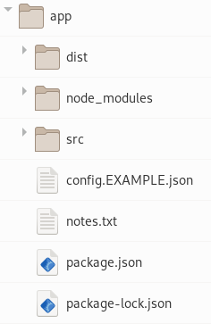
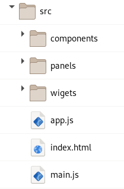

# h2js
H2JS is a coder centric web application framework.  H2JS attempts to limit itself to vanilla javascript and standard browser features.  If you enjoy writing in code and prefer standard browser features over the latest framework h2js may be for you. 

### SEE
[h2js-init](https://github.com/technomada/h2js-init) -- Creates scaffolding

[h2js-element](https://github.com/technomada/h2js-element) -- Simple custom element wrapper class


### TRY IT

#### Create Project Scaffolding
```sh
$ npx h2js-init   ... note: depending on your network speed this step may take a little time.
```


#### Build Project
```sh
$ cd app

(edit ./src files)

$ npx h2js build
```

#### Run/View
```sh
$ python -m http.server ./dist   (or your fav local web server)

http://localhost:8000
```


### DESIGN
- VanillaJS / Browser as a platform
- Simple thin framework
- Webpack compiled (use npm libraries)


### STRUCTURE (and interesting files)

#### Project File Structure


**src** = application source files

**dist** = project compiles here (copy these files to your production server to go live)

#### Application Structure


**index.html** - doc setup

**app.js** - your application specific code

( sub directories and files optional for organization )


### EXAMPLE
```sh
$ npm i -S h2js-element
```

**app.js**
```js

import ElementClass from 'h2js-element'
import Clock from './clock-element.js'

class App extends ElementClass {
	constructor(){
		let name = 'app'
		let C = `
			<style>
			</style>
			`

		super(name,C)
		
		let i = new Clock('green')
		this.shadow.appendChild(i.element)	
		}
	}

export default App
```
&nbsp;


**clock-element.js**
```js
import ElementClass from 'h2js-element'

class ClockElement extends ElementClass{

	constructor(faceColor){
		faceColor = faceColor || 'white'
	
		let C = `
			<style>
				.display {color: ${faceColor};}
			</style>
			<div class='display'></div>
			`
		super('clock',C)
		this.shadow.querySelector('.display').textContent = new Date()
		}
	}

export default ClockElement
```

